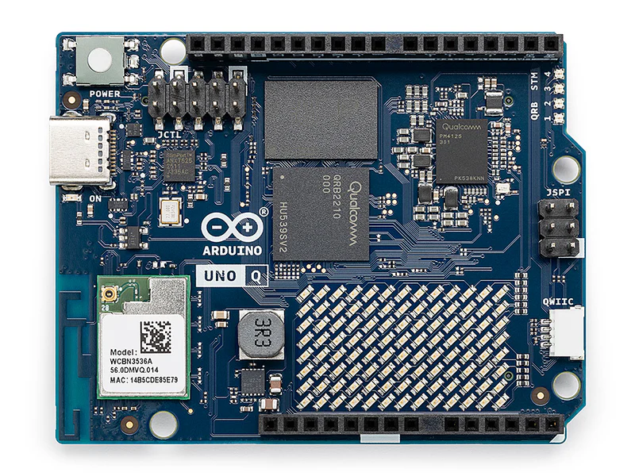

The Arduino UNO Q is an unusual board: it pairs an MCU running classic C++ sketches with a CPU running Linux for Python applications, and the two communicate with each other over an internal bridge. This dual architecture means setup is more involved than a typical Arduino board. The Linux side also comes ready for AI workloads out of the box, which is what makes the on-device person detection in this project possible without any separate inference hardware.

<p align="center">
  
</p>

## Python application

The person detection app is based on Arduino's built-in "Person Classifier on Camera" example. 
That example sets up a `VideoImageClassification` stream and a `WebUI`, then streams every detection (label, confidence, timestamp) to the browser as JSON over a Socket.IO message. 

This project builds on that scaffold: the confidence threshold is raised and a debounce window is added so the camera doesn't fire as many repeated detections for the same person standing in frame, the detection stream is filtered down to the "person" class before anything reaches the dashboard. 

Recording is built on top of the same camera stream the detection model already has open. When recording starts, a background thread grabs frames directly from the detection pipeline's camera object and writes them to an `.mp4` file at 10 FPS. When it stops, the file is re-encoded from `mp4v` to H.264 with `ffmpeg`. Browsers don't reliably play `mp4v` natively, so this conversion is what makes the recording actually playable in the dashboard's video element.

Recordings, listing, and deletion are all exposed as plain HTTP endpoints through the same `WebUI` brick used for detection streaming. `start-recording` and `stop-recording` toggle the background capture, `list-recordings` returns the available files newest-first, and a `DELETE` endpoint removes a given recording. The dashboard's Recording Control widget wraps all four calls with buttons and an inline player, so none of this needs to be touched manually, but they're plain `curl`-able endpoints if you want to script around them or check the camera independently of the browser.

## Deployment and usage: UNO Q development in VS Code

The UNO Q's Linux side is managed over SSH rather than through a USB serial connection, so most of the day-to-day workflow happens from a terminal once the board is on your network. One can also use Arduino App Lab as a development environment option. However. I encountered many bugs and lacks of ergonomy. The software is still under development and may be a preferred option in the future. Hence, I highly recommend another IDE for the Arduino UNO Q.

### Connecting

Find the board's IP address under AppLab => Bottom of page, then connect over SSH:

```bash
ssh arduino@<UNO_Q_IP_ADDRESS>
```

To work in VS Code directly against the board's filesystem, use the Remote-SSH extension: `Ctrl+Shift+P` => **Remote-SSH: Open SSH Configuration File...** => select your `~/.ssh/config` => add or edit a `HostName` entry with the board's IP address.

```config
Host YOURHOSTNAME
    HostName YOURIPADDRESS
    User arduino (if not changed by you)
```

### Managing apps with `arduino-app-cli`

```bash
# List available apps
arduino-app-cli app list

# Start an app
arduino-app-cli app start ~/apps/YourAppName

# Stop an app
arduino-app-cli app stop ~/apps/YourAppName

# View an app's Python logs
arduino-app-cli app logs ~/apps/YourAppName
```

### Working with Docker directly

Each app runs inside its own Docker container on the Linux side, which is occasionally useful to inspect directly:

```bash
# List all containers, including stopped ones
docker ps -a

# Start a specific container
docker start <container_id>

# Run a Python script inside a running container
docker exec <container_id> python main.py
```

### Python dependencies

To add Python libraries to an app, create a `requirements.txt` file inside that app's `python/` folder. If you change `requirements.txt` after the app has already built once, the cached build may not pick up the change. Clearing the app's cache forces a rebuild:

```bash
rm -rf ~/apps/YourAppName/.cache
```

### Troubleshooting

- Keep `app.yaml` and `sketch.yaml` in sync with what the app actually needs: `app.yaml` declares the Bricks (web UI, video classification, etc.) the Python side uses, and `sketch.yaml` declares the libraries the MCU sketch needs. A mismatch here is a common source of an app that builds but doesn't run correctly.

- If you require to modify a brick code please find the code [here](https://github.com/arduino/app-bricks-py) and paste the code as is done in this project before importing your modified brick.
