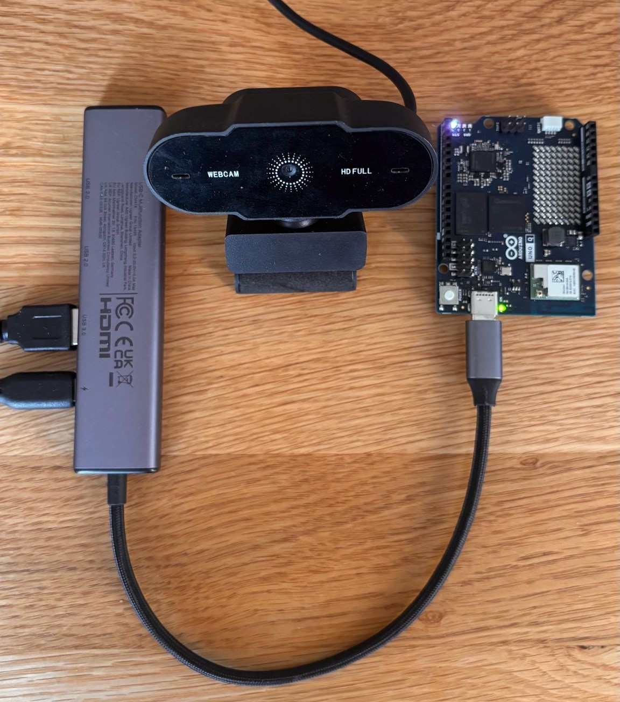
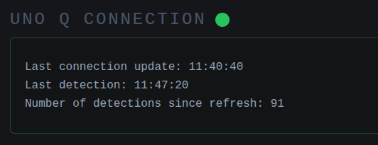
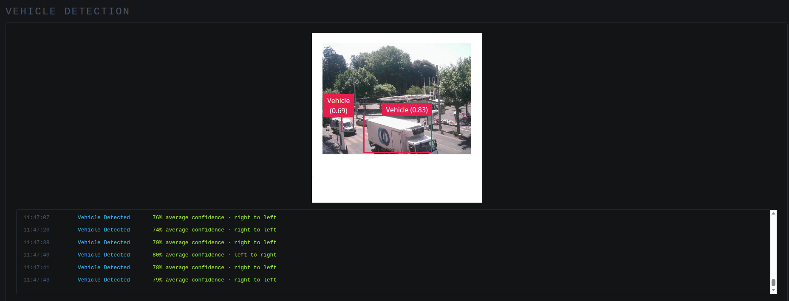
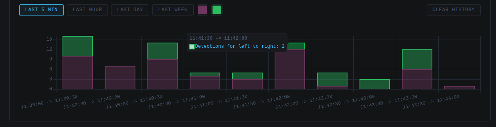

# Traffic Flow Estimation

A real-time traffic flow tracker that bridges an Arduino UNO Q with a USB camera to a live web dashboard. It detects vehicles (cars, buses, and trucks excluding bicycles and motorcycles), tracks them and their direction, and streams traffic flow data to a live dashboard for visualizing pipeline results and getting first insights from the data.

All running from a browser via Socket.IO on the local network.

https://github.com/user-attachments/assets/e6233895-3bfb-4539-87b5-fe647224761f

**[Live dashboard](https://thomaslenges.github.io/trafficFlow/)** hosted via GitHub Pages. This hosted demo shows the dashboard UI only since it isn't connected to any running hardware, no local data is present (which is why the graph appears empty).

Deploy the project yourself to try out the model and tune key parameters explained later in this README!

## Hardware

<p align="center">
  
</p>

Project hardware:

-  [**Arduino UNO Q**](https://store.arduino.cc/pages/uno-q?utm_source=google&utm_medium=cpc&utm_campaign=EU-UNO-Q&gad_source=1&gad_campaignid=23081042134&gbraid=0AAAAACbEa852hSoIGIYWjmJBsA_YCgtWe&gclid=EAIaIQobChMI_KXSqY2QlQMVj5CDBx1UZxhpEAAYASAAEgKkfvD_BwE)
-  [**USB Webcam**](https://www.amazon.fr/-/en/veorkide-Webcam-Full-1080P-30FPS/dp/B0G7C4VPLG)
-  [**Powered USB-C Hub**](https://www.amazon.de/UGREEN-Revodok-Datenports-Multiport-Thinkpad/dp/B0BR3M8XHK)

These links are meant to specify the exact part used, not to endorse a particular retailer. Feel free to source equivalents elsewhere.

## Software

### Detection

The vehicle detection model was built and trained using [Edge Impulse](https://www.edgeimpulse.com/). The full Edge Impulse project including dataset, training experiments, and exported models is publicly available [here](https://studio.edgeimpulse.com/studio/1003932).

<p align="center">
  
</p>

#### Data Collection & Labelling
New data was collected by connecting the UNO Q to Edge Impulse via the data forwarder:
```bash
$ edge-impulse-data-forwarder
```
In total, 399 data items were collected and labelled, with an 83%/17% train/test split.

Only cars, trucks, and buses were labelled, all under a single class: `Vehicle`. Motorcycles and bicycles were deliberately excluded from the dataset to minimize false positives on pedestrians.

**Tip**: label around 100 images first and train an initial model, then use that model to assist in labelling the rest of the dataset. Manual correction is still needed, but it saves significant time. 100 labelled images is already enough to get a model with usable results.

#### Model Selection & Optimization
The main challenge was balancing inference time against accuracy: the model needed to run in real time on the UNO Q's Qualcomm Adreno 702 GPU, with low enough latency to support reliable tracking.

The first attempt used a YOLO model at full 320×320 RGB resolution (307,200 features), trained for 100 cycles at a learning rate of 0.001. While accuracy was strong, inference time was far too slow around 1097ms per frame, or roughly 0.9 FPS in the best case, before even accounting for the rest of the pipeline.

From there, resolution was progressively reduced to bring inference time down, with the following results (all FP32 model version, evaluated on UNO Q):

| Resolution | Features | Inference Time | Approx. FPS | Flash Usage | mAP | Accuracy (legacy) |
|---|---|---|---|---|---|---|
| 320×320 | 307,200 | 1097 ms | ~0.9 | 27.5 MB | 0.71 | 93.42% |
| 160×160 | 76,800 | 282 ms | ~3.5 | 27.5 MB | 0.63 | 92.11% |
| 96×96 | 27,648 | 138 ms | ~7.2 | 27.5 MB | 0.58 | 84.21% |

*(mean Average Precision (mAP) measures how well the model both locates and correctly classifies objects across different confidence thresholds with 1.0 being a perfect score.)*

Reducing the resolution further below 96×96 caused accuracy to drop sharply to the point of being unusable, so this was treated as the practical lower bound for YOLO at this feature count.

**FOMO MobileNetV2 0.35** was also explored as a lightweight alternative, and looked very promising on paper with an inference time of just 46ms alongside strong metrics:

| Metric | Value |
|---|---|
| Accuracy | 0.83 |
| Precision (non-background) | 0.99 |
| Recall (non-background) | 0.89 |
| F1 Score (non-background) | 0.94 |

However, once deployed, FOMO performed poorly in practice: it produced multiple overlapping detections on single vehicles and a high rate of false positives, making it unsuitable for reliable tracking despite its strong benchmark numbers.

**The 96×96 YOLO model was ultimately selected** for this project, as it offered the best practical trade-off between real-time inference speed and detection accuracy.

Following model generation, the **VideoObjectDetection brick** was used to deploy and run the model on-device, taking inspiration from Arduino's built-in example apps for the UNO Q.

**Disclaimer**: The model may require finetuning to account for your specific camera positioning and outdoor weather conditions (only tested on good sunlight conditions).

### Tracking

### Dashboard

#### Connection Status
The dashboard opens a Socket.IO connection to the Arduino UNO Q and reflects its state in real time. A status dot turns green when connected and red when disconnected, paired with a card showing the timestamp of the last connection change and the last detection received. A running count of detections since the page was last refreshed gives an at-a-glance sense of activity and confirms the pipeline is alive end-to-end from camera to UNO Q to browser.

<p align="center">
  
</p>

#### Live Feed & Detection Log
An embedded iframe streams the live annotated video feed such as done by Arduino built-in app [video-generic-object-detection](https://github.com/arduino/app-bricks-examples/tree/main/examples/common/video-generic-object-detection). Below is a detection log lists each vehicle as it's detected along with its average confidence score (updated in real-time). Once a vehicle's direction of travel is determined the corresponding log entry updates with it.

<p align="center">
  
</p>

#### Traffic Flow Chart
Detections are aggregated into a bar chart showing flow by direction (right-to-left vs. left-to-right) with hover tooltips. Four filter buttons (5 min / 1 hour / 1 day / 1 week) enable visualizing different time windows. Two color pickers are present to customize the chart's RTL/LTR bar colors to taste. Both color choices and detection history (up to one week) persist locally via `localStorage`. A reset button is available to clear the stored history entirely.

<p align="center">
  
</p>

## Deployment
